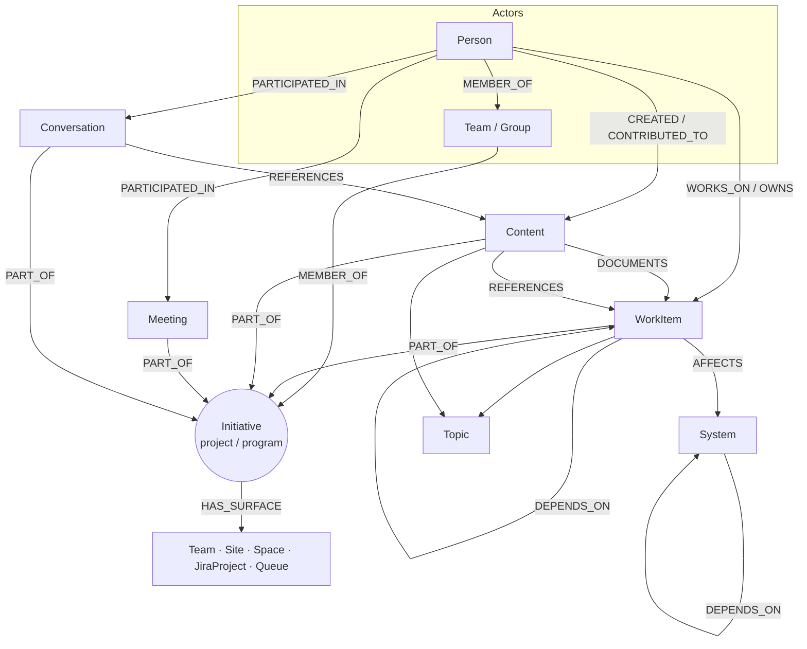

# The Enterprise Brain — A Concept-First Context Graph

**Goal:** a graph that thinks in the organisation's own terms — *people, initiatives, work, content, systems* — so that when someone asks a question, we resolve the **concept** and fan out, instead of asking them which tool to look in.

**The inversion:** We do **not** start from Outlook/Teams/Jira/ServiceNow/etc. Sources are not entities — they are *observations* of entities. We model the real-world things once, then let each source **feed** them. (No agent/content extraction — every node and edge still comes from structured metadata; see Layer 3.)

---

## 1. The three layers

```
┌───────────────────────────────────────────────────────────────┐
│  LAYER 1 — CANONICAL ENTITY GRAPH  (the brain; source-agnostic)│
│  People · Initiatives · Work · Content · Systems · Topics      │
│  connected by a small set of semantic verbs                    │
├───────────────────────────────────────────────────────────────┤
│  LAYER 2 — OBSERVATIONS  (each canonical node = 1..n records)  │
│  resolution & identity rules fold many records into one entity │
├───────────────────────────────────────────────────────────────┤
│  LAYER 3 — FEEDS  (provenance only)                            │
│  Outlook · Teams · Calendar · SharePoint · OneDrive ·          │
│  ServiceNow · Jira · Confluence                                │
└───────────────────────────────────────────────────────────────┘
```

A query lands in **Layer 1** ("what's happening on Project Atlas?"), resolves to the `Initiative` concept, and traverses — pulling every manifestation regardless of which source it came from. Layer 3 only ever answers *"where did this fact come from, and can I trust/secure it?"*

---

## 2. The higher-order objects (pillars)

These are the nouns the business actually talks in. Each is **source-agnostic** and usually **assembled from several sources**.

| Pillar | What it is | Why it's first-class |
|---|---|---|
| **Person** | A human actor, one identity across every system | Almost every question starts at or passes through a person. The universal join. |
| **Initiative** *(Project / Program / Product / Workstream)* | A durable effort that work, content, people and conversation cluster around | **The organising context.** Most questions are scoped to one. It exists in *no single source* — it's assembled. This is the highest-leverage concept for retrieval. |
| **Work** *(WorkItem)* | A unit of work with state, owner, lifecycle | "What's being done / operated, by whom, in what state." |
| **Content** *(Artifact)* | Any information object a person produced | "Where's the thing that says…" — unified across files, pages, messages. |
| **Communication** *(Conversation / Meeting)* | Time-anchored interaction between people | Surfaces *what is being discussed and decided*, via participation + links (not by reading text). |
| **System** *(Service / Asset)* | The technology things run on or affect | Ownership, impact, and expertise around systems. |
| **Topic** | A lightweight concept/label — **native tags only** | Cross-cuts everything; no inference. |

> **Containers are not pillars.** A SharePoint site, Teams team, Confluence space, Jira project are not separate concepts — they are the **surfaces of an Initiative**. Modeling them as `Initiative -[:HAS_SURFACE]-> …` is what collapses eight silos into one workspace (Section 4).

---

## 3. Canonical node model (Layer 1)

Pure concepts and their *resolution rule* — **no source columns here on purpose.**

| Concept | Subtypes | Identity / resolution rule |
|---|---|---|
| `Person` | employee, contractor, requester | One identity per human; resolve by email / AAD objectId / Atlassian accountId / ServiceNow user, keeping all source ids as aliases |
| `Team` / `Group` | team, department group, queue | by group id; `Team` and its M365 `Group` are the same entity |
| `Initiative` | portfolio › program › project › workstream | **assembled** — see Section 4; one Initiative may bind a Jira project + Confluence space + Teams team + SharePoint site + ServiceNow portfolio |
| `WorkItem` | deliverable/issue, incident, request, change, problem, task, epic | one per source record (Jira key, ServiceNow number); epics/sprints organise it |
| `Content` | document(file), page, message(email/chat), comment, knowledge-article | **one entity per real artifact** — the *same* file in SharePoint, OneDrive and as an attachment folds into one `Content` with many manifestations (match on webUrl/eTag) |
| `Conversation` | thread, channel, chat | the durable container of messages |
| `Meeting` | event, online meeting | dedupe across attendees by `iCalUId` |
| `System` | service, application, environment, CI | by CMDB sys_id; the asset things depend on |
| `Topic` | tag, label, category | native term only; same label across sources = one `Topic` |

---

## 4. The Initiative — the load-bearing concept

Most enterprise questions are **scoped to an initiative** ("everything about Atlas", "who's on the migration", "the spec for the payments rework"). No source owns this concept, so we **assemble** it — and the quality of that assembly *is* the accuracy of the brain.

**An Initiative binds its surfaces:**

```
Initiative ──HAS_SURFACE──▶ Team (Teams)            ⟵ messages, meetings
           ──HAS_SURFACE──▶ Site (SharePoint)       ⟵ files, pages
           ──HAS_SURFACE──▶ Space (Confluence)      ⟵ knowledge pages
           ──HAS_SURFACE──▶ JiraProject (Jira)      ⟵ work items
           ──HAS_SURFACE──▶ Queue (ServiceNow)      ⟵ incidents/changes
```

**How membership is resolved (highest → lowest confidence):**
1. **The M365 Group backbone** — a single Group id *simultaneously* backs a Teams Team, a SharePoint Site, a group mailbox and a calendar. One structural fact unifies chat + files + meetings for free.
2. **Native cross-app links** — Jira project ⇄ Confluence space links; Jira ⇄ Confluence remote links; explicit integration mappings.
3. **Declared mapping** — a curated registry: "Initiative Atlas = {Jira: ATLAS, Confluence: ATL, Team: …, Site: …}". Worth maintaining for top initiatives.
4. **Naming / convention** — matching keys/prefixes (use as a hint, score it, don't trust blindly).
5. **Co-participation** — the same people + the same documents recurring across surfaces (a weak signal that *strengthens* an existing binding, never the sole basis).

Everything attached to a surface is therefore `PART_OF` the Initiative transitively. **This single edge is what turns scattered artifacts into "everything about X."**

---

## 5. Canonical edge model (the verbs of the brain)

A deliberately **small, semantic** verb set — each verb is later fed by many source fields. Role is a property on the edge, not a new edge type.

### Actor → anything (who did what)
| Verb | Meaning | Typical ends |
|---|---|---|
| `:OWNS` | accountable for | Person/Team → WorkItem, Content, System, Initiative |
| `:WORKS_ON` | active responsibility | Person → WorkItem (assignee), Initiative |
| `:CREATED` | produced it | Person → Content |
| `:CONTRIBUTED_TO` | edited / commented | Person → Content, WorkItem |
| `:PARTICIPATED_IN` | present / messaged / received | Person → Meeting, Conversation, Content |
| `:REQUESTED` | initiated the work | Person → WorkItem (reporter/caller) |
| `:MEMBER_OF` | belongs to | Person → Team/Group → Initiative |

### The context spine (what binds the brain)
| Verb | Meaning | Typical ends |
|---|---|---|
| `:PART_OF` | belongs to a context | WorkItem / Content / Conversation / Meeting → Initiative |
| `:HAS_SURFACE` | an initiative's per-tool home | Initiative → Team/Site/Space/JiraProject/Queue |
| `:SUBPART_OF` | hierarchy | Issue→Epic, Page→Page, Project→Program, Initiative→Portfolio |
| `:IN_CONTAINER` | physically lives in | Content → surface (file in Site, page in Space, message in Conversation) |

### Knowledge & linkage (explicit links only)
| Verb | Meaning | Typical ends |
|---|---|---|
| `:REFERENCES` | explicitly links/attaches | Content/Conversation → Content / WorkItem |
| `:DOCUMENTS` | describes / specs | Page / KnowledgeArticle → WorkItem / System |
| `:ABOUT` | tagged with a concept | anything → Topic |

### Operational (impact & dependency)
| Verb | Meaning | Typical ends |
|---|---|---|
| `:AFFECTS` | acts on a system | WorkItem → System |
| `:DEPENDS_ON` | needs another | WorkItem→WorkItem, System→System |
| `:RUNS_ON` | hosted by | Service → System/Environment |

> Seven actor verbs + four spine verbs + six link/ops verbs ≈ **17 edge types** describe the whole enterprise. Keeping the verb set small is what makes both ingestion *and* querying tractable.

---

## 6. Concept diagram (Mermaid)



The shape to notice: **Initiative is the hub, Person is the spine, everything else hangs off those two.** That is the brain.

---

## 7. Why concept-first retrieves more accurately

| Source-first (the trap) | Concept-first (this model) |
|---|---|
| User must know *which tool* holds the answer | User asks in business terms; we resolve the **concept** |
| Returns fragments per silo | Returns the **whole** entity, deduped across manifestations |
| "Atlas" means a Jira project *or* a Team *or* a site | "Atlas" resolves to **one `Initiative`** that binds all of them |
| The same file appears 3× (SharePoint, attachment, OneDrive) | **One `Content`** node, three observations |
| Expertise is invisible | Expertise = `Person` who repeatedly `OWNS`/`CREATED`/`WORKS_ON` around a `System`/`Initiative` |

Relevance is computed from **relationships, not text**: participation, ownership, explicit links, co-occurrence around a shared Initiative/System, and edge recency. No content mining required.

---

## 8. Example questions → concept → traversal

| Question | Resolve to | Traversal |
|---|---|---|
| "Everything about Project Atlas." | `Initiative:Atlas` | `Initiative ─HAS_SURFACE→ {surfaces} ←IN_CONTAINER─ Content / WorkItem / Conversation / Meeting`; rank by recency |
| "What is Priya working on?" | `Person:Priya` | `Person ─WORKS_ON→ WorkItem(open)`, `─CREATED→ Content(recent)`, `─PARTICIPATED_IN→ Meeting(this week)`, grouped by `PART_OF Initiative` |
| "Who owns the Payments service?" | `System:Payments` | `System ←OWNS← Person/Team`; corroborate with `←AFFECTS← WorkItem →WORKS_ON→ Person` frequency |
| "Where's the spec for ATLAS-128?" | `WorkItem:ATLAS-128` | `WorkItem ←DOCUMENTS← Page`, `←REFERENCES← Content/Conversation` |
| "Impact if CI-DB-07 fails?" | `System:CI-DB-07` | `System ←DEPENDS_ON*← System`, then `←AFFECTS← WorkItem`, then `→OWNS→ Team` |
| "Who knows about the migration?" | `Initiative:Migration` | people ranked by `OWNS`/`CREATED`/`WORKS_ON` count within the Initiative |

---

## 9. Layer 3 — how each concept is **fed** (provenance, demoted)

Now (and only now) the sources. Each canonical node/edge is *supplied and reinforced* by structured fields. Every stored element carries `source_system`, `source_id`, `source_url`, `derived_from(field)`, `captured_at`.

**Nodes ← feeds**

| Concept | Fed by (structured) |
|---|---|
| `Person` | AAD user (Graph), ServiceNow `sys_user`, Atlassian user, mail senders/recipients |
| `Team`/`Group` | Microsoft 365 Groups / Teams |
| `Initiative` *(assembled)* | M365 Group ↔ Team ↔ Site; Jira `project`; Confluence `space`; ServiceNow portfolio/queue; declared registry |
| `WorkItem` | Jira `issue`; ServiceNow `incident`/`sc_req_item`/`change_request`/`problem`/`task` |
| `Content` | SharePoint/OneDrive `driveItem`; SharePoint `page`; Confluence `content`; email/chat messages; comments; attachments |
| `Conversation` | Outlook `conversationId`; Teams `channel`/`chat` |
| `Meeting` | Graph `event` / `onlineMeeting` |
| `System` | ServiceNow `cmdb_ci` |
| `Topic` | Jira labels, Confluence labels, SharePoint managed metadata, ServiceNow category |

**Edges ← feeds (representative)**

| Verb | Fed by field(s) |
|---|---|
| `:OWNS` | driveItem owner; ServiceNow `assignment_group`; service/CI owner; Jira project lead |
| `:WORKS_ON` | Jira `assignee`; ServiceNow `assigned_to` |
| `:CREATED` | `createdBy`; Confluence `version.by`; message `from` |
| `:CONTRIBUTED_TO` | `lastModifiedBy`; comment authors |
| `:PARTICIPATED_IN` | event `attendees`; mail `to/cc/bcc`; Teams `from`/`mentions` |
| `:REQUESTED` | ServiceNow `caller_id`/`opened_by`; Jira `reporter` |
| `:MEMBER_OF` | group/team membership; project roles |
| `:PART_OF` | surface ownership (IN_CONTAINER → HAS_SURFACE); Jira `project`; Confluence `space`; M365 group |
| `:HAS_SURFACE` | M365 Group id; declared Initiative registry; Jira/Confluence links |
| `:IN_CONTAINER` | `driveItem.parentReference`; page `space`; message `channelIdentity` |
| `:REFERENCES` | reference/cloud attachments; Teams shared-file records; link cards (**structured only**) |
| `:DOCUMENTS` | Jira⇄Confluence remote links / Jira macro |
| `:AFFECTS` | ServiceNow `incident.cmdb_ci` |
| `:DEPENDS_ON` | `cmdb_rel_ci`; Jira `issuelinks` (Blocks/Relates) |

> The `:REFERENCES` edge uses **only structured signals** (reference attachments, shared-file records, link cards) — never IDs scraped from message bodies. That keeps the whole graph within the "no content extraction" rule.

---

## 10. The accuracy engine (resolution rules to invest in)

1. **Person resolution** — deterministic on email/AAD/accountId; aliases retained. (Done once, pays everywhere.)
2. **Content resolution** — fold the same artifact across SharePoint/OneDrive/attachment into one `Content` (webUrl/eTag), keeping manifestations.
3. **Initiative assembly** — the registry + M365-group backbone + native links, with a *confidence score* on each `HAS_SURFACE`/`PART_OF`. This is where retrieval quality is won or lost — invest here first for your top initiatives.
4. **Security trimming** — carry permission/sharing edges so results are filtered to what the asker may see, at query time.

---

## 11. Build order

1. **Spine:** `Person` resolution + `Team`/`Group` + the M365-group backbone.
2. **Context:** `Initiative` assembly (registry + group backbone) and the `PART_OF`/`HAS_SURFACE` spine.
3. **Substance:** `Content`, `WorkItem`, `Conversation`, `Meeting` attached to initiatives; actor verbs.
4. **Operations & knowledge:** `System`/CMDB, `:AFFECTS`/`:DEPENDS_ON`, `:DOCUMENTS`, native cross-links.
5. **Quality:** security trimming + recency/centrality ranking.

---

### Appendix — provenance fields on every node & edge
```
source_system   which feed supplied this observation
source_id        native id (issue key, sys_id, message id, driveId+itemId, content id)
source_url       deep link back
derived_from     the exact field (e.g. "incident.cmdb_ci", "event.attendees")
captured_at      ingestion time
confidence       for assembled edges (HAS_SURFACE / PART_OF / SAME_AS)
```
